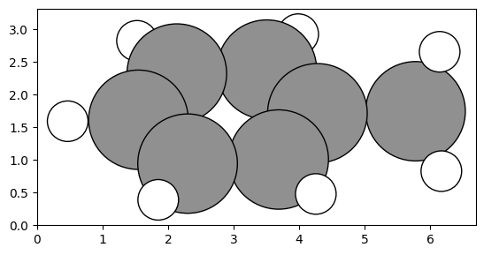
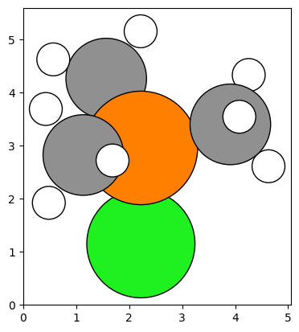
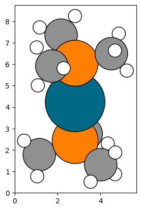

## Table of contents 

- [Table of contents](#table-of-contents)
- [🤓 Course overview and learning outcomes](#-course-overview-and-learning-outcomes)
- [💻 Before we continue...](#-before-we-continue)
- [Init](#init)
- [Preparing assets for Blender](#preparing-assets-for-blender)
  - [Converting SMILES into 3D](#converting-smiles-into-3d)
  - [⚡Metal Complex structures](#metal-complex-structures)
    - [⛑️ Helper Function](#️-helper-function)
    - [💡Make ligand with \*SMILES (surrogate smiles)](#make-ligand-with-smiles-surrogate-smiles)
    - [💡PdL2](#pdl2)
    - [💡PdL2Y2](#pdl2y2)
  - [🎥 Make blenderized traj](#-make-blenderized-traj)

## 🤓 Course overview and learning outcomes 

The goal of this mini-workshop is to give you a brief introduction on how to use python to generate atomistic structures ready for Blender. We’ll also provide you with materials for further learning and a few ideas to get you started. 🚀

## 💻 Before we continue...

To run this notebook/code snipets you will need only a few packages installed (if you don't have them already). In additon, we will use autoadsorbate (wich only requires rdkit and ase):
```python
pip install rdkit
pip install ase
pip install autoadsorbate
```
We will use these basic packages to construct structures of our choice, using ```SMILES``` and ```*SMILES``` (for more info see: https://github.com/basf/autoadsorbate). We will start by making a few molecular structures, we will construct complex geometries, and finally we will make a trajectory so that we can render images in bulk.

We will use free and portable (no install required) software:
Blender (download: )
Inkscape (download: )

## Init
Let us start with importing the required packages:

```python
from ase import Atoms
from ase.visualize.plot import plot_atoms
from ase.io import read, write
import autoadsorbate as au
```

## Preparing assets for Blender

To visualize molecules in Blender 3D, we need a way of generating their 3D atomic positions, for this we use ```AutoAdsorbate``` (a combination of ```rdkit``` and ```ase```)

### Converting SMILES into 3D

We can easily convert any ```SMILES``` string into a molecular geometry using the following code:

```python
f = au.Fragment('Cc1ccccc1', to_initialize=1)
atoms = f.get_conformer(0)
plot_atoms(atoms, rotation='-60x')
```    



If we have multiple molecules we can use a simple for-loop to collect all molecules in a list:

```python
smiles = [
    'Cc1ccccc1',
    'Brc1ccccc1',
    '[Mg](C)Br',
    '[Mg](Br)Br',
]

molecules = []
for s in smiles:
    molecules.append(au.Fragment(s, to_initialize=1).get_conformer(0)) 
```

### ⚡Metal Complex structures

Unfortunately, ```rdkit``` cannot help us with the geometries of the metal complex structures. But it is relatively easy to prepare structures for illustration purposes (or as input for e.g. quantum chemical simulations) using a few tricks:

#### ⛑️ Helper Function

AutoAdsorbate (https://github.com/basf/autoadsorbate) comes with a convenient function ```align_to_vector``` that will orient a ligand (provided as ```*SMILES``` - surrogate smiles), to an arbitrary cartesian vector. We only need to provide the central metal atom, surrogate smiles of the species attachec to it, and the vectors to define the complex geometry.

```python
def get_complex_structure(central_atom, smiles, vectors):
    """"
    helper function that creates a complex (/interediate) out of
    a central metal atom, complex geometry and *SMILES (surrogate smiles).
    For more information on *SMILES see: https://github.com/basf/autoadsorbate
    """
    complex = central_atom.copy()
    
    for i, v in enumerate(vectors):
        # prepare ligand
        ligand = au.Fragment(
            smiles[i], to_initialize=1
            ).get_conformer(0)                        # converts *SMILES string to XYZ oriented towards Z
        ligand = au.Smile.align_to_vector(ligand, v)  # aligns the conformer to the gemetry of the complex
        del ligand[0]                                 # removes the surrogate atom
        complex+=ligand
    return complex
```

#### 💡Make ligand with *SMILES (surrogate smiles)

Lets's make a ligand using ```*SMILES``` (surrogate smiles). We can construct a Trimethylphosphine; fisrt we define the surrogate atom (Cl),
we can then bind the surrogate atom to the P atom (atom that coordinates to the metal center). We can then use the P-Cl bond to orient the ligand in the proper orientation with respect to the metal complex geometry.

```python
# '*[P](C)(C)C' we use Cl as surrogate atom: 'Cl[P](C)(C)C'

f = au.Fragment('Cl[P](C)(C)C', to_initialize=1) #here we are using the Cl-P bond to orient the ligand
atoms = f.get_conformer(0)
plot_atoms(atoms, rotation='-60x')
```
    


We can look up know metal complex geometries (e.g. https://en.wikipedia.org/wiki/Tetrahedron), and take note:

```python
# https://en.wikipedia.org/wiki/Tetrahedron
complex_geometry = {
    'linear': [[0,0,1], [0,0,-1]],
    'tetrahedron': [[1,1,1],[-1,-1,1],[1,-1,-1],[-1,1,-1]]
}
```

#### 💡PdL2

Now we are ready to construct our metal complex:

```python
Pd_atom = Atoms(symbols=['Pd'], positions=[[0,0,0]])

smiles = [
    'Cl[P](C)(C)C',
    'Cl[P](C)(C)C',
]

vectors = complex_geometry['linear']

PdL2 = get_complex_structure(Pd_atom, smiles, vectors)

plot_atoms(PdL2, rotation='-60x')
```
    

    


#### 💡PdL2Y2

Following the same logic, we can construct additional reacion intermediates:

```python
Pd_atom = Atoms(symbols=['Pd'], positions=[[0,0,0]])

smiles = [
    ['Cl[P](C)(C)C','Cl[P](C)(C)C', 'ClBr', 'Clc1ccccc1'],
    ['Cl[P](C)(C)C','Cl[P](C)(C)C', 'ClC', 'Clc1ccccc1']
]

vectors = complex_geometry['tetrahedron']

Pd_comps = []

for s in smiles:
    Pd_comps.append(get_complex_structure(Pd_atom, s, vectors))

```

We can write these configurations to an XYZ file (Blender can read this file format).

```python
collected_traj = molecules + [PdL2] + Pd_comps
write('./collected_traj.xyz', collected_traj)
```

### 🎥 Make blenderized traj

If We want to load all molecular and metal complex species, and render them with Blender as one command, we need to make sure that
all structures have the same number of atoms and atomic species, and that these are sorted uniformly in all structures (frames).
The trajectory we constructed does not fulfill this criterion:

```python
collected_traj = read('./collected_traj.xyz', index=':')

for a in collected_traj:
    formula = a.get_chemical_formula(empirical=True)
    write('./individual_frames_xyz/{formula}.xyz', a) # let's also write the individual frames to separate xyz files.
    print(formula)
```

    C7H8
    C6H5Br
    CH3BrMg
    Br2Mg
    C6H18P2Pd
    C12H23BrP2Pd
    C13H26P2Pd

But we can use an AutoAdsorbate helper function to prepare a trajectory that does (it will add additional atoms, "somewhere far away from the molecule" - hide_spot, so that they don't appear in the render):

```python
blend_traj = au.utils.get_blenderized(collected_traj, hide_spot=[0,0,-100])

for a in blend_traj:
    print(a.get_chemical_formula(empirical=True))
    
write('./collected_traj.xyz', collected_traj)
```

    C13H26Br2MgP2Pd
    C13H26Br2MgP2Pd
    C13H26Br2MgP2Pd
    C13H26Br2MgP2Pd
    C13H26Br2MgP2Pd
    C13H26Br2MgP2Pd
    C13H26Br2MgP2Pd

```python

```
